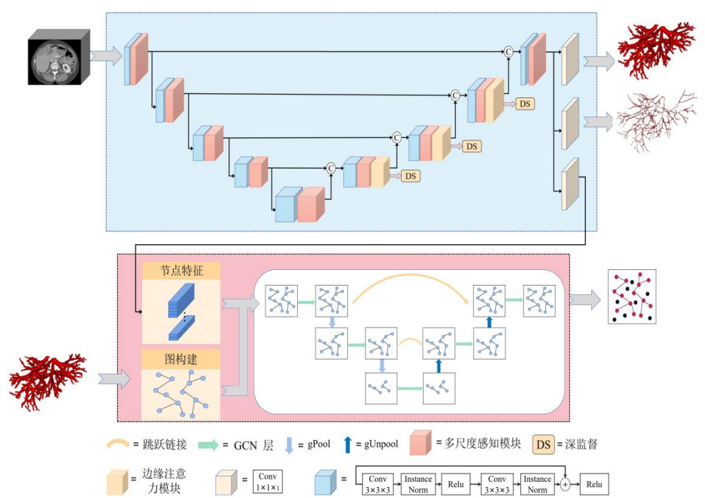

# Liver Vessel Segmentation with Graph

A research project for liver vessel segmentation combining **multi-task learning**, **vessel prior guidance**, and **graph neural networks**, based on the **3Dircadb1** dataset.

This repository implements **Multi-Task and Prior-Guided Network** for accurate hepatic vessel segmentation. It incorporates a graph learning module to model vascular connectivity and employs **SAM-Med3D-turbo** as the backbone for feature extraction.

<p align="center">
  
</p>

---

## 🔍 Project Highlights

- **Multi-task learning**: Jointly predicts liver, vessels, and vessel skeletons to enhance structural awareness.
- **Vessel prior guidance**: Leverages anatomical priors like centerlines to refine segmentation.
- **Graph neural network module**: Models vessel connectivity using GNNs for better topological consistency.
- **Strong backbone**: Uses [SAM-Med3D-turbo checkpoint](https://drive.google.com/file/d/1MuqYRQKIZb4YPtEraK8zTKKpp-dUQIR9/view?usp=sharing) for effective 3D medical feature extraction.

---

## 🗂️ Dataset

We use the **[3Dircadb1](https://www.ircad.fr/research/3dircadb/)** dataset, which contains 20 annotated 3D abdominal CT scans with detailed vessel and liver labels.

---


## 🚀 Quick Start

### 1. Environment Setup

```bash
conda create -n myenv python=3.9
conda activate myenv
pip install -r requirements.txt
